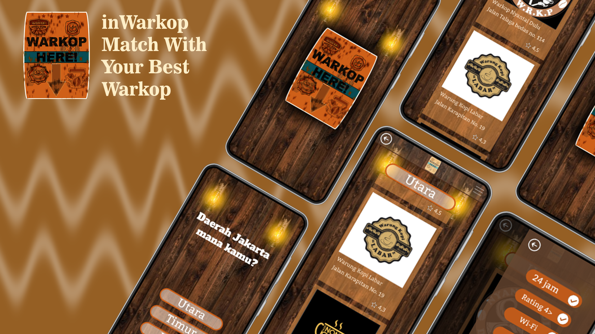

# inWarkop - Match with Your Best Warkop

## Bangkit Capstone Project 2024

Bangkit Capstone Team ID : C241-PR542  
Here is our repository for Bangkit 2024 Capstone project. Our team consist of 3 Machine Learning, 2 Mobile Development, and 2 Cloud Computing.

## Our Warriors

|              Name              | Bangkit-ID   |   Learning Path    |                                                       Contact Link                                                       |
| :----------------------------: | :----------: | :----------------: | :----------------------------------------------------------------------------------------------------------------------: |
|  Ahmed Siddiq Arrafi Ibn Sakti | M001D4KY1566 |  Machine Learning  |     [LinkedIn](https://www.linkedin.com/in/ahmed-sakti-1128641b4/) or [GitHub](https://github.com/ahmedsiddiqar)         |
|        Ariftra Rahmawati       | M004D4KX2754 |  Machine Learning  |                [LinkedIn](https://www.linkedin.com/) or [GitHub](https://github.com)                                     |
|       Usmita Surani Putri      | M008D4KX2496 |  Machine Learning  |              [LinkedIn](https://www.linkedin.com/in/usmitasurani/) or [GitHub](https://github.com/usmitasp)              |
|       Gibrand Awaina Putra     | C009D4KY0631 |  Cloud Computing   |    [LinkedIn](https://www.linkedin.com/in/gibrand-awaina-putra-37022022b/) or [GitHub](https://github.com/Gibrand22)     |
|   Azizan Artiandi Akbar Fauzi  | C161D4KY0845 |  Cloud Computing   |      [LinkedIn](http://www.linkedin.com/in/azizan-artiandi-1552412a3) or [GitHub](https://github.com/Jijan5)             |
|     Fadhlil Naufal Mahardian   | A012D4KY4587 | Mobile Development |        [LinkedIn](https://www.linkedin.com/in/fadhlil-naufal-mahardian/) or [GitHub](https://github.com/fadhlilnm)       |
|          Rivan Fauzan          | A012D4KY4589 | Mobile Development |         [LinkedIn](http://www.linkedin.com/in/rivan-fauzan-082622258) or [GitHub](https://github.com/rivanansar)         |

## About this project

The capstone project that our team created is inWarkop. so inWarkop is an android application whose function is to find Warkop in the Jakarta area, this application will make it easier for you to find Warkop if you want to drink coffee with friends.

## Documentation

## System Architecture

## Repositories

|    Branch Name     |                                      Branch Link                                         |
| :----------------: | :--------------------------------------------------------------------------------------: |
| Mobile Development | [MD Branch](https://github.com/fadhlilnm/C241-PR542/tree/MD) |
|  Cloud Computing   | [CC Branch](https://github.com/fadhlilnm/C241-PR542/tree/CC)      |
|  Machine Learning  | [ML Branch](https://github.com/fadhlilnm/C241-PR542/tree/ML)       |

## UI/UX Design

- Link Prototype Design : [Prototype](https://www.figma.com/proto/E3FdMv9JI6ztkQxKpM5VH7/Capstone-Project?page-id=344%3A211&node-id=344%3A246&viewport=465%2C233%2C0.32&scaling=scale-down&starting-point-node-id=344%3A239) 

## Deployment Link APK Waras

Download Link APK Waras: 
[inWarkop (Google Drive)](https://drive.google.com/drive/u/4/folders/1Ab0YwTP36JpWb2J52iYDjUWgD9VJCY9Q)
