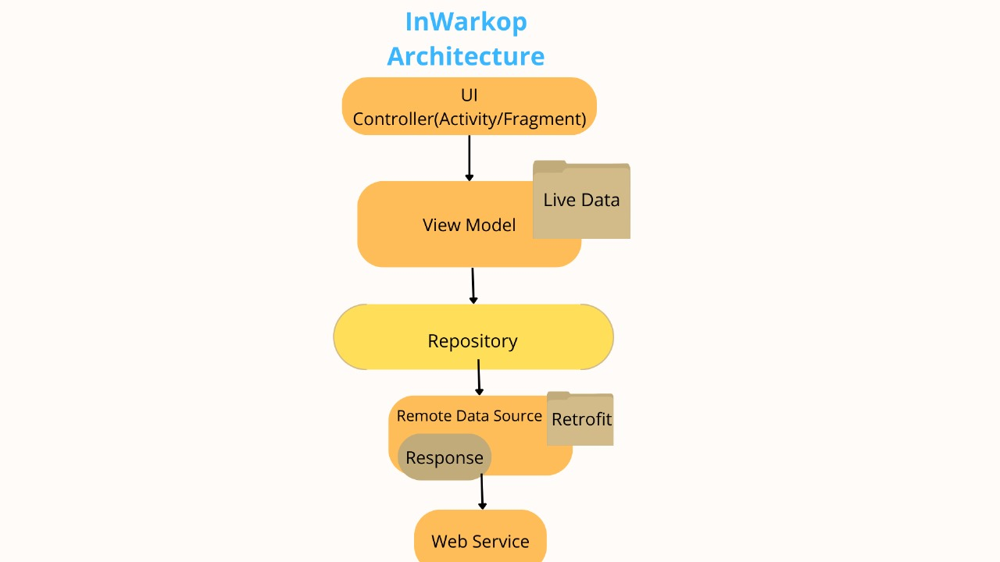

# C241-PR542 Mobile Development

<h1 align="center">
  InWarkop
</h1>

## Bangkit Capstone Project 2022

Bangkit Capstone Team ID : C241-PR541 <br>
Here is our repository for Bangkit 2024 Capstone project - Mobile Development.

## Android Development Schedule
|  Task  |     Week 1     |       Week 2        |            Week 3          |            Week 4          |
| :----: | :------------: | :-----------------: | :------------------------: | :------------------------: |
|  1 | UI/UX Design   | Create Main UI      |Add Some Features           | User Testing               |  
| 2 | Create Concept |                     |                            | Fix Bugs          | 

## Android Architecture
- MVVM Architecture

## Prototype
- [Prototype](https://www.figma.com/design/AnOSRajgjhnxInUQ08gVf3/capstone?node-id=0-1&t=7xK7JlY18MtIrvly-0)
## Our Features 
- Splash Screen\
  Upon launching the app, a visually appealing splash screen is displayed, featuring the InWarkop logo.
- Home Screen\
  The home screen serves as the main hub of the app, providing easy access to the main feature.
- Warkop List\
  warkop screen which displays a list of warkops in Jakarta based on their area.

## Libraries and Dependecies
- RecyclerView
- Glide  
- Retrofit 2 and OKHTTP3
- Livedata dan Viewmodel
- Gson Converter

## Libraries and Dependecies
- Internet\
The app needs access to the internet to communicate with the server and retrieve data.

## Installation
 * ### Prerequisites
    - Android Studio
 * ### Installations
    - Clone This Project 
    ```bash
    $ git clone https://github.com/fadhlilnm/C241-PR542.git
    ```
    - Open the project in Android Studio
    - Run the application
